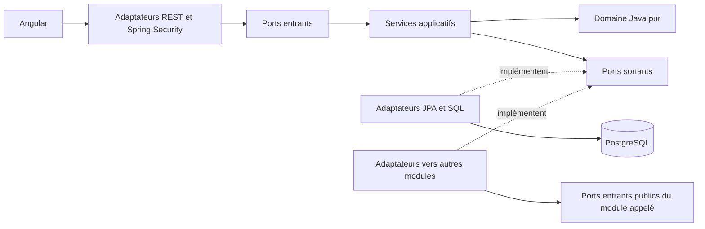

# Architecture de BricoComptoir

Statut : architecture cible, socle technique en place. Date : 24 septembre 2026.

## 1. État constaté et périmètre

Le répertoire local ne contenait que `.git`. Aucun fichier suivi, aucun commit,
aucune branche locale matérialisée par un commit. `HEAD` désigne `main` à naître.
L'origine est `https://github.com/skpato1/brico-comptoir.git` ;
`git ls-remote --symref origin` a réussi sans retourner de référence.
Le dépôt local et le distant vérifié sont donc vides au début de cette étape.

Ce document définit la cible métier. Le socle implémente seulement le démarrage,
la santé, les migrations initiales et la fermeture des routes non autorisées ;
les modules métier restent à réaliser. La [roadmap](roadmap.md) organise leur réalisation et le
[suivi](progress.md) distingue les étapes terminées des étapes prévues.

BricoComptoir vend des articles de quincaillerie aux particuliers en Tunisie,
à l'unité ou sous forme de packs composés de produits individuels.

Décisions pour le premier périmètre :

- Une boutique, un dépôt de stock, une devise TND, interface française initiale.
- Quantités entières dans l'unité de vente du produit : une boîte de vis peut
  être un produit. Vente au poids ou à la découpe hors premier périmètre.
- Packs virtuels, sans stock propre, sans packs imbriqués ni substitutions.
- Consultation publique ; compte client obligatoire pour commander.
- Panier conservé dans le navigateur avec uniquement références et quantités.
  Aucun stock réservé au panier, aucune promesse de prix et aucune adresse
  conservée dans ce stockage. Synchronisation entre appareils différée.
- Paiement à la livraison comme hypothèse initiale ; pas d'intégration bancaire
  ni de faux écran de paiement. Tarif de livraison forfaitaire configurable
  côté serveur et obligatoire avant ouverture commerciale.
- Les tarifs, règles fiscales, zones desservies et procédures de livraison
  devront être validés par l'exploitant avant ouverture ; aucun taux fiscal ou
  montant commercial n'est inventé ici.

## 2. Structure technique et frontières

Un monolithe Spring Boot déployable, un frontend Angular et une base PostgreSQL.
Un seul projet Maven backend, organisé par modules métier et contrôlé par des
tests d'architecture. Multiplier les artefacts Maven n'est pas nécessaire au
démarrage. Le socle fixe Java 21, Spring Boot 4.1.1, Angular 21.2.24,
Node 24.18.0, PostgreSQL 18.6 et Maven 3.9.16 via son wrapper.
Spring Security 7.1.1 et Flyway 12.4.0 suivent les versions gérées par le parent Spring Boot ;
les dépendances frontend sont résolues dans `package-lock.json`.

La page Angular utilise la même origine via Nginx en Compose ou le proxy Angular
en développement natif. Seuls `GET /api/v1/health`, `GET /api/v1/health/readiness`
et `GET /api/v1/health/liveness` sont publics à cette étape. Aucun compte par
défaut n'est créé. Le [contrat OpenAPI implémenté](openapi.yaml) est limité à ces
routes. Le [README](../README.md) décrit les commandes et profils `local`, `test`, `prod`.

MinIO et Mailpit sont ajoutés au Compose local comme outils indépendants :
aucun adaptateur métier de stockage ou d'email n'est encore introduit.
MinIO est construit depuis la version officielle `RELEASE.2025-10-15T17-29-55Z`,
sa distribution communautaire étant désormais fournie en sources ; Mailpit
utilise `v1.31.2`. Voir la [publication MinIO](https://github.com/minio/minio/releases/tag/RELEASE.2025-10-15T17-29-55Z).

Arborescence cible, à créer lors des étapes suivantes :

```text
backend/
  pom.xml
  src/main/java/tn/bricocomptoir/
    bootstrap/                 # démarrage et assemblage Spring
    identity/
    catalog/
    inventory/
    sales/
  src/main/resources/db/migration/
  src/test/
frontend/
  src/app/
    core/                      # transport HTTP et session
    features/                  # catalogue, panier, compte, commandes, administration
    shared/                    # composants de présentation
docs/
AGENTS.md
```

Chaque module backend suit cette structure :

```text
<module>/
  domain/                      # entités, valeurs, invariants, Java pur
  application/
    port/in/                   # cas d'usage publics et contrats Java immuables
    port/out/                  # besoins du module : dépôt, horloge, autre module
    service/                   # orchestration, règles d'accès applicatives
  adapter/
    in/web/                    # REST, validation du transport, DTO HTTP
    out/persistence/           # entités JPA/SQL et mappings
    out/module/                # appels des ports publics d'autres modules
    security/                  # intégration Spring Security si nécessaire
    transaction/               # décorateurs transactionnels Spring
```



Les flèches pleines représentent les appels ; les adaptateurs implémentent les
interfaces définies au centre. Le câblage Spring est extérieur au domaine.

### Dépendances autorisées

| Couche | Dépendances permises | Interdictions principales |
| --- | --- | --- |
| `domain` | JDK, domaine de son propre module | Spring, JPA, Jackson, HTTP, Angular, autres modules |
| `application` | Domaine local, ports et contrats locaux, JDK | Spring, JPA, adaptateurs, imports directs d'un autre module |
| `adapter` | Application/domaine locaux, bibliothèques techniques nécessaires | Règles métier cachées dans un contrôleur ou une entité JPA |
| `adapter/out/module` | Ports entrants et DTO Java publics du module appelé | Services internes, domaine, repositories ou tables du module appelé |
| `bootstrap` | Configurations et assemblage des modules | Logique métier |
| Angular | Contrats HTTP publiés | Accès à PostgreSQL, modèle JPA, décision d'autorisation faisant foi |

Les DTO HTTP, objets métier et entités JPA sont distincts ; aucun chargement JPA
paresseux ne traverse un port. Les ports n'exposent pas `Page`, `ResponseEntity`,
`Authentication` ou d'autres types Spring. Pas d'annotations Spring ou JPA dans
le domaine ni dans l'application. Les règles seront vérifiées avec ArchUnit.
Pas de module `common` générique : quelques valeurs locales simples peuvent
être dupliquées tant qu'aucun contrat partagé stable n'est nécessaire.

## 3. Modules, ports et adaptateurs

| Module | Responsabilité et données possédées | Ports entrants principaux | Ports sortants principaux |
| --- | --- | --- | --- |
| `identity` | Comptes, profil minimal, identifiants de connexion, rôles, état actif | Inscrire un client, lire son profil, charger une identité pour l'authentification, administrer les accès | `AccountRepository`, `PasswordHasher` |
| `catalog` | Catégories, produits, packs, compositions, prix et publication | Consulter le catalogue, obtenir un instantané d'offres vendables, administrer produits et packs | `CatalogRepository` |
| `inventory` | Quantités physiques et réservées, réservations, mouvements | Lire la disponibilité, réceptionner/ajuster, réserver/libérer/consommer en interne | `StockRepository`, `ReservationRepository`, `MovementRepository`, `ProductReferencePort` |
| `sales` | Commandes, lignes figées, coordonnées de livraison, politique de frais, idempotence | Prévisualiser un achat, commander, consulter ses commandes, annuler, traiter une commande | `OrderRepository`, `IdempotencyRepository`, `OfferSnapshotPort`, `StockPort`, `DeliveryFeePolicy`, `Clock` |

Ces noms sont des contrats conceptuels, pas une obligation de créer une classe
par verbe. Les interfaces apparaissent avec leur premier cas d'usage réel.

Adaptateurs prévus :

- REST/JSON et filtres Spring Security pour les entrées externes.
- JPA pour les agrégats persistés ; SQL ciblé dans l'adaptateur de stock pour
  les verrous et mises à jour atomiques. Les modèles persistés restent privés.
- `PasswordEncoder` Spring Security derrière `PasswordHasher` ; chargement des
  comptes derrière l'adaptateur d'authentification, sans exposer les hashes REST.
- Adaptateurs internes synchrones : `sales` appelle `catalog` et `inventory` ;
  `inventory` appelle `catalog` pour valider les références produit lors d'une
  réception ou d'un ajustement administratif.
- Horloge système et configuration des frais côté serveur pour `sales`.

Graphe intermodules autorisé : `sales -> inventory -> catalog` et
`sales -> catalog`. `identity` ne dépend d'aucun de ces trois modules.
Le câblage de sécurité fournit à chaque cas d'usage un acteur Java immuable
créé depuis l'identité authentifiée ; cet acteur ne provient jamais du JSON
client. La commande mémorise son `customerId`, sans importer le domaine identité.

Le catalogue ne dépend pas du stock. Angular combine la lecture des offres et
leur disponibilité indicative ; la commande vérifie de nouveau le stock réel.
Les mutations de réservation ne sont pas exposées directement en HTTP.
Les appels entre modules restent locaux, sans bus, requêtes HTTP internes,
microservices, CQRS séparé ou event sourcing.

## 4. Modèle conceptuel et invariants

| Concept | Identité et relations | Règles essentielles |
| --- | --- | --- |
| Compte | UUID, email normalisé unique, hash, rôles, état actif, version | Inscription = `CUSTOMER` uniquement ; désactivation conservant l'historique |
| Catégorie | UUID, libellé, actif, version | Un produit appartient à une catégorie ; archivage interdit tant qu'elle contient des produits actifs |
| Produit | UUID, SKU unique, catégorie, libellé, unité, prix, actif, version | Une référence vendable et stockable ; quantité entière ; archivage plutôt que suppression |
| Pack | UUID, code unique, libellé, prix propre, actif, version | Au moins un composant ; prix indépendant de la somme des composants |
| Composant de pack | `(packId, productId)`, quantité positive | Un produit au plus une fois par pack ; pas de référence à un autre pack |
| Stock produit | `productId` unique, `onHand`, `reserved` | `0 <= reserved <= onHand` ; disponible = `onHand - reserved` |
| Réservation | `(orderId, productId)` unique, quantité, état | État `ACTIVE`, `RELEASED` ou `CONSUMED` ; quantité agrégée par produit |
| Mouvement | UUID, produit, type, deltas physique/réservé, référence, acteur, date, motif | Journal append-only ; correction par mouvement compensateur |
| Commande | UUID, numéro unique, client, statut, adresse figée, total, date | Propriété serveur, montants figés, transitions explicites |
| Ligne de commande | Commande, type `PRODUCT`/`PACK`, référence, quantité | Libellé, version, prix et composition copiés au moment de l'achat |
| Composant commandé | Ligne pack, produit, SKU/libellé figés, quantité unitaire | Explique les produits réellement réservés, même si le pack évolue |
| Requête idempotente | `(customerId, operation, key)` unique, empreinte, commande | Empêche une deuxième commande lors d'un renvoi du même achat |

Relations : catégorie `1 -> N` produits ; pack `1 -> N` composants `N -> 1`
produit ; client `1 -> N` commandes ; commande `1 -> N` lignes ; commande
`1 -> N` réservations produit. Les relations intermodules sont des identifiants,
pas des associations JPA navigables.

Les montants sont des valeurs décimales exactes en TND, avec trois décimales,
via un objet valeur local basé sur `BigDecimal` ; jamais `float` ou `double`.
Les saisies avec précision excessive sont rejetées. Les contrats JSON utilisent
des chaînes décimales et la devise. Les prix de vente affichés sont les prix
finaux à payer ; les règles fiscales détaillées restent à valider avant vente.
Total = somme des prix unitaires figés multipliés par les quantités + livraison.
Pas de promotions, conversion monétaire ou moteur fiscal dans le premier lot.

Un pack n'est vendable que si lui-même et tous ses composants sont actifs.
La disponibilité d'un pack seul est le minimum de
`floor(disponibleProduit / quantitéDansPack)` sur ses composants. Ce nombre
est indicatif : dans un panier mixte, toutes les demandes d'un même produit
s'additionnent, qu'elles proviennent d'un produit seul ou de plusieurs packs.
Une ligne de stock absente équivaut à zéro disponible.

Le catalogue fournit un instantané cohérent de toutes les offres demandées
(prix, versions, état des composants, composition), lu en une requête SQL sous
le même instantané PostgreSQL. Toute modification de prix, composition ou
publication incrémente la version de l'offre concernée. Une commande utilise
la version acceptée lors de cette lecture ; une édition du catalogue commise
ensuite ne réécrit jamais la commande. Ce choix évite de verrouiller tout le
catalogue pendant le passage de commande.

## 5. Authentification et RBAC

### Session et sécurité du navigateur

Même origine en production : Angular sur `/`, backend sur `/api/v1` derrière le
reverse proxy. En développement, proxy Angular vers le backend. Session serveur
Spring Security ; identifiant en cookie `HttpOnly`, `Secure` en production,
`SameSite=Lax`, sans attribut `Domain`. Rotation de session à la connexion,
expiration après 30 minutes d'inactivité, déconnexion par POST et invalidation
serveur. Une instance backend au départ, sessions en mémoire : un redémarrage
demande une reconnexion. Le besoin de plusieurs instances justifierait plus tard
un stockage de sessions partagé.

CSRF actif sur toutes les mutations, y compris connexion, inscription et logout.
`GET /auth/csrf` délivre le cookie `XSRF-TOKEN`, lisible par Angular ; celui-ci
renvoie `X-XSRF-TOKEN`. Le cookie de session reste inaccessible à JavaScript.
Obtenir un nouveau jeton après connexion/déconnexion et utiliser l'intégration
SPA adaptée à la version retenue de Spring Security, notamment pour les jetons
différés et BREACH. Voir les références officielles
[Spring Security CSRF](https://docs.spring.io/spring-security/reference/servlet/exploits/csrf.html)
et [Angular XSRF](https://angular.dev/best-practices/security#httpclient-xsrf-csrf-security).

Pas de JWT dans `localStorage`, de serveur OAuth maison ou de fournisseur
d'identité supplémentaire au départ. CORS fermé en production ; une éventuelle
exception de développement doit énumérer les origines exactes. TLS obligatoire,
CSP adaptée au build Angular, pas de secrets ou mots de passe dans les logs.

Les mots de passe sont hachés via `DelegatingPasswordEncoder` et un encodeur
adaptatif Argon2id configuré et mesuré sur le serveur cible ; le format stocké
permet une évolution des paramètres. Aucune cryptographie maison. Référence :
[stockage des mots de passe Spring Security](https://docs.spring.io/spring-security/reference/features/authentication/password-storage.html).
Limiter les essais de connexion et d'inscription, retourner une erreur de
connexion générique, borner la taille des entrées et ne jamais sérialiser les
identifiants techniques sensibles.

Un filtre vérifie l'état actif et les rôles actuels du compte à chaque requête
authentifiée, afin qu'une désactivation ou un retrait de rôle prenne effet sans
attendre l'expiration de la session. Le premier administrateur est créé par
une commande d'exploitation explicite avec secret fourni à l'exécution ;
aucun compte/mot de passe par défaut ni endpoint public de promotion.

### Matrice d'accès

Les rôles sont explicites et cumulables ; `ADMIN` n'implique pas `CUSTOMER`.

| Action | Visiteur | `CUSTOMER` | `ADMIN` |
| --- | --- | --- | --- |
| Lire catalogue publié et disponibilité publique | Oui | Oui | Oui |
| S'inscrire, se connecter, obtenir CSRF | Oui | Oui | Oui |
| Prévisualiser un achat / passer commande | Non | Oui | Si aussi `CUSTOMER` |
| Lire ses commandes | Non | Ses propres commandes | Via consultation administrative |
| Annuler une commande `CONFIRMED` | Non | Sa propre commande | Toute commande autorisée |
| Lire/gérer catalogue non publié, produits et packs | Non | Non | Oui |
| Recevoir/ajuster le stock, lire les mouvements | Non | Non | Oui |
| Préparer, expédier, livrer, annuler avant expédition | Non | Non | Oui |
| Désactiver un compte ou changer ses rôles | Non | Non | Oui, contrôle du dernier administrateur actif |

Spring Security refuse par défaut toute route non explicitement autorisée et
filtre les routes publiées ; les services applicatifs vérifient également
les permissions, la propriété des ressources et les transitions métier avec
l'acteur fiable. Un UUID non devinable ne remplace pas ce contrôle. Une commande
d'un autre client retourne `404` sur le parcours client ; une session absente
retourne `401`, un rôle insuffisant ou un CSRF invalide `403`. Aucun guard Angular
ne remplace ces protections. Les opérations administratives sensibles sont
auditées avec acteur, cible et date, sans exposer de données personnelles inutiles.
Les modifications d'accès sont sérialisées dans une transaction du module
identité avant de vérifier qu'au moins un administrateur actif subsiste ; deux
retraits concurrents ne doivent pas pouvoir contourner cette règle.

## 6. Stock, commandes et transactions

### Frontière transactionnelle

Une seule source de données et un seul gestionnaire de transactions PostgreSQL.
Un décorateur Spring autour du cas d'usage entrant ouvre la transaction ; les
appels internes à `inventory` participent à la même transaction (`REQUIRED`,
jamais `REQUIRES_NEW` pour le stock d'une commande). Une erreur métier doit
provoquer le rollback complet, y compris si elle est une exception vérifiée.
Aucun appel réseau externe pendant les verrous.

Isolation initiale `READ COMMITTED`, avec verrous explicites sur les lignes de
stock, et contraintes en base. Les transactions concurrentes attendent les
verrous puis relisent les quantités. Prendre tous les verrous de produits dans
l'ordre croissant de leur UUID réduit les interblocages ; une erreur transitoire
de verrouillage annule tout et autorise un nouvel essai borné de la transaction.
Référence : [verrous PostgreSQL](https://www.postgresql.org/docs/current/explicit-locking.html).

### Passer une commande

1. Authentifier l'acteur client ; valider les quantités, les limites de requête
   et l'adresse. Exiger une clé `Idempotency-Key`.
2. Dans la transaction, acquérir la clé unique portée par ce client et
   l'opération. Une collision attend la transaction précédente ; même empreinte
   = retourner la commande existante, empreinte différente = `409`.
3. Relire un instantané catalogue et les frais serveur. Comparer versions
   d'offres et total attendus à la prévisualisation confirmée par le client.
   Une divergence impose une nouvelle prévisualisation (`409 OFFER_CHANGED`).
4. Décomposer les packs, multiplier par les quantités commandées et agréger
   les besoins par produit. Borner les calculs pour éviter les dépassements.
5. Verrouiller chaque ligne de stock concernée avec `SELECT ... FOR UPDATE`
   dans l'ordre convenu. Contrôler `onHand - reserved >= besoin` pour tous les
   produits. Une ligne absente ou insuffisante fait échouer l'ensemble.
6. Incrémenter `reserved`, créer les réservations `ACTIVE` et les mouvements
   `RESERVE`. Créer la commande `CONFIRMED` et ses instantanés de lignes.
7. Associer la clé idempotente à la commande et committer une seule fois.
   Si une écriture échoue, ni commande, ni réservation, ni clé réussie ne subsiste.

La clé et l'empreinte normalisée de la requête sont conservées avec la commande.
Un renvoi après perte de réponse retrouve cette commande, même si le catalogue
a changé entre-temps. Une réservation reste active jusqu'au traitement ou à
l'annulation ; le premier périmètre à paiement à la livraison n'introduit pas
de réservation temporaire ni de tâche d'expiration. L'administration doit rendre
visibles les commandes en attente pour éviter les immobilisations oubliées.

### Cycle de vie et écritures de stock

```text
CONFIRMED -> PREPARING -> SHIPPED -> DELIVERED
    |            |
    +------------+------> CANCELLED
```

| Opération | Delta physique | Delta réservé | Conditions |
| --- | --- | --- | --- |
| Réception | `+q` | `0` | Admin, produit valide, quantité positive, motif/référence |
| Ajustement | `+/-q` | `0` | Admin, motif obligatoire, nouveau physique >= réservé |
| Réservation | `0` | `+q` | Commande nouvelle, disponibilité suffisante |
| Annulation | `0` | `-q` | Réservation active, avant expédition |
| Expédition | `-q` | `-q` | Réservation active, commande `PREPARING` |
| Livraison | `0` | `0` | Commande `SHIPPED` |

Annulation et expédition verrouillent d'abord la commande, puis les stocks dans
le même ordre, puis changent réservations, mouvements et statut dans une seule
transaction. Cela tranche une course entre ces deux opérations. Une transition
déjà appliquée est sans nouvel effet ; une transition incompatible retourne
`409`. Le client ne peut annuler que `CONFIRMED`, l'admin également `PREPARING`.
Les retours après expédition nécessitent un futur cas d'usage dédié : aucun
restockage automatique par changement arbitraire de statut.

Réceptions et ajustements portent un `operationId` unique pour rejouer une
requête sans doubler le mouvement ; la même clé avec d'autres paramètres est
rejetée. La première réception crée la ligne de stock à zéro via insertion
protégée par unicité, puis la verrouille et l'incrémente. Un historique n'est
jamais supprimé pour corriger un stock. La mise à jour du solde et le mouvement
correspondant sont toujours atomiques.

## 7. Persistance et migrations

Une base, un schéma applicatif PostgreSQL `bricocomptoir`, tables préfixées par module
(`identity_`, `catalog_`, `inventory_`, `sales_`). Chaque table appartient à un
seul module. Pas de lecture/écriture ni jointure intermodules dans les repositories.
Les identifiants externes sont validés via ports ; les références historiques
survivent à l'archivage. Les clés étrangères sont internes aux modules au départ.

Contraintes prévues : SKU/email/codes uniques, unicité stock par produit et
réservation par commande/produit, clés d'idempotence uniques, quantités positives,
soldes non négatifs et `reserved <= onHand`. Le journal et les soldes sont
cohérents grâce aux écritures transactionnelles ; un contrôle de rapprochement
permettra de détecter une anomalie d'exploitation sans réécrire l'historique.
Versions optimistes pour les éditions administratives, avec conflit explicite.

Flyway est l'unique responsable du DDL, dans une séquence globale versionnée
`V<numero>__<module>_<description>.sql`. Une migration déjà appliquée est immuable.
JPA valide le schéma (`ddl-auto=validate`) ; pas de `update`/`create` en production.
Tester les migrations sur base vide et depuis la version précédente. Le compte
de migration a les droits DDL ; le compte applicatif dispose des droits DML
nécessaires. Les données de démonstration restent hors migrations de production.

Le socle crée le schéma par Flyway et applique V1 pour ses permissions et les
droits par défaut des futures tables. Il n'ajoute aucune table métier factice.
Les comptes de migration et d'application sont distincts, y compris en local.
Les secrets locaux sont générés dans `.env` ignoré par Git ; en production ils
doivent être injectés par l'environnement. MinIO/Mailpit ne conditionnent pas
la santé de l'API tant qu'aucun cas d'usage ne dépend d'eux.

Les instants sont stockés en UTC (`timestamptz`) et présentés en `Africa/Tunis`.
Adresses et téléphones sont des chaînes structurées, pas des nombres ; le pays
initial est `TN`, avec validation serveur du gouvernorat, code postal, adresse
et téléphone. Sauvegardes et restauration testée sont requises avant ouverture.

## 8. Contrats API à implémenter

### Conventions

- REST JSON UTF-8 sous `/api/v1`. Le contrat OpenAPI du socle décrit la santé ;
  il sera étendu à chaque tranche fonctionnelle.
- Identifiants UUID en chaînes, dates ISO 8601 avec décalage UTC, montants
  `{"amount":"49.900","currency":"TND"}`. Aucune entité JPA en réponse.
- Listes paginées : `page` à partir de 0, `size` de 1 à 100, défaut 20 ; tri
  sur liste blanche avec second critère stable par identifiant.
  Réponse `{items, page, size, totalElements}`.
- Corps strictement validés et bornés ; maximum initial de 100 lignes par achat
  et 1 à 999 unités par ligne, contrôlés avant et après fusion des doublons.
  Rejeter les champs sensibles inconnus, notamment
  `roles` à l'inscription, `customerId`, prix imposé ou statut dans une commande.
- Prix et stock sont calculés par le serveur. Les versions/total attendus
  envoyés par le navigateur expriment un accord, jamais une valeur de confiance.
- `201` + `Location` pour une création, `200` pour lecture ou transition retournant
  la ressource, `204` pour logout/CSRF. `400` validation, `401` non connecté,
  `403` accès/CSRF, `404` absent ou non visible, `409` conflit métier/version,
  `429` limitation d'essais. Les réponses privées portent `Cache-Control: no-store`.
- Erreurs `application/problem+json` : `type`, `title`, `status`, `detail`,
  `instance`, plus `code`, `traceId` et éventuellement `violations` par champ.
  Aucun SQL, secret ou stack trace en réponse.

### Endpoints et permissions

Les chemins ci-dessous sont relatifs à `/api/v1` ; ils décrivent une cible,
sans affirmer que les routes existent déjà.

| Méthode et chemin | Entrée / résultat principal | Accès |
| --- | --- | --- |
| `GET /auth/csrf` | `204`, délivre/renouvelle le cookie CSRF | Public |
| `POST /auth/register` | `{email,password,displayName}` -> `201` profil ; aucune connexion implicite | Public + CSRF |
| `POST /auth/login` | `{email,password}` -> `200` profil + session | Public + CSRF |
| `POST /auth/logout` | Invalide la session -> `204` | Session + CSRF |
| `GET /me` | `{id,email,displayName,roles}` | Connecté |
| `GET /categories` | Catégories publiées paginées | Public |
| `GET /products`, `GET /products/{id}` | Recherche/pagination ; offre publiée, prix et version | Public |
| `GET /packs`, `GET /packs/{id}` | Offre publiée et composants `{productId,quantity}` | Public |
| `GET /availability?productIds=...` | Au plus 100 références publiées : `{productId,availableQuantity}` | Public |
| `POST /checkout/preview` | Articles + adresse -> offres/version, montants des lignes, livraison, total ; sans réservation | `CUSTOMER` |
| `POST /orders` | Articles/version + adresse + total attendu ; en-tête `Idempotency-Key` -> `201` commande | `CUSTOMER` |
| `GET /orders`, `GET /orders/{id}` | Commandes du client connecté uniquement | `CUSTOMER` |
| `POST /orders/{id}/cancel` | Annulation autorisée -> `200` commande | Propriétaire `CUSTOMER` |
| `GET /admin/products`, `GET /admin/packs`, `GET /admin/categories` | Listes incluant les entrées non publiées | `ADMIN` |
| `POST /admin/products`, `POST /admin/packs`, `POST /admin/categories` | Création validée -> `201` | `ADMIN` |
| `PUT /admin/products/{id}`, `PUT /admin/packs/{id}`, `PUT /admin/categories/{id}` | Données complètes + version attendue -> `200`, ou `409` ; `active=false` pour archiver | `ADMIN` |
| `GET /admin/stock`, `GET /admin/stock/movements` | Soldes physiques/réservés ou journal paginé | `ADMIN` |
| `POST /admin/stock/receipts` | `{operationId,productId,quantity,reason}` -> mouvement | `ADMIN` |
| `POST /admin/stock/adjustments` | `{operationId,productId,delta,reason}` -> mouvement | `ADMIN` |
| `GET /admin/orders`, `GET /admin/orders/{id}` | Toutes les commandes, filtre de statut | `ADMIN` |
| `POST /admin/orders/{id}/prepare`, `/ship`, `/deliver`, `/cancel` | Transition explicite -> commande, pas de statut arbitraire | `ADMIN` |
| `GET /admin/accounts` | Comptes paginés, sans hash | `ADMIN` |
| `PUT /admin/accounts/{id}/access` | `{active,roles,version}` -> profil ; préserver un admin actif | `ADMIN` |

Toutes les mutations de ce tableau exigent CSRF. Les prévisualisations sont
privées même si elles ne réservent rien. Les disponibilités publiques excluent
les offres non publiées, sans divulguer les quantités réservées ni le journal.

### Exemple de passage de commande

Exemple de format uniquement : les identifiants ne désignent pas des produits
existants. `/checkout/preview` reçoit les mêmes articles sans `expectedVersion`
ni `expectedTotal`, et renvoie les versions et montants calculés à confirmer.
Les lignes de même type/référence sont fusionnées avant contrôle des limites
et calcul de l'empreinte idempotente.

```http
POST /api/v1/orders
Content-Type: application/json
Idempotency-Key: 50166cab-19db-4e13-a051-02876255bd6f
X-XSRF-TOKEN: <jeton obtenu du serveur>
```

```json
{
  "items": [
    {"kind": "PRODUCT", "offerId": "67b6678e-6638-4e6e-9233-a0a8c370a9f2", "quantity": 2, "expectedVersion": 3},
    {"kind": "PACK", "offerId": "da5398cc-01d8-453e-910c-6b01eb2f6a30", "quantity": 1, "expectedVersion": 2}
  ],
  "deliveryAddress": {
    "recipient": "Exemple de destinataire",
    "line1": "10 rue Exemple",
    "city": "Tunis",
    "governorate": "Tunis",
    "postalCode": "1000",
    "country": "TN",
    "phone": "+21620000000"
  },
  "paymentMethod": "CASH_ON_DELIVERY",
  "expectedTotal": {"amount": "49.900", "currency": "TND"}
}
```

Le serveur retourne `{id, number, status, items, deliveryAddress, paymentMethod,
subtotal, deliveryFee, total, createdAt}` ; chaque ligne inclut les instantanés
décrits au modèle conceptuel. Le premier succès vaut `201` avec `Location` ;
un rejeu identique vaut `200` avec le même identifiant et sans effet supplémentaire.
La même clé avec un autre corps normalisé donne `409 IDEMPOTENCY_CONFLICT`.
La création de commande ne prétend pas que le paiement a été encaissé.

Exemple d'erreur attendue :

```json
{
  "type": "urn:bricocomptoir:problem:insufficient-stock",
  "title": "Stock insuffisant",
  "status": 409,
  "detail": "La commande ne peut pas être réservée intégralement.",
  "instance": "/api/v1/orders",
  "code": "INSUFFICIENT_STOCK",
  "traceId": "identifiant-de-correlation"
}
```

Autres codes stables : `VALIDATION_ERROR`, `AUTHENTICATION_REQUIRED`,
`ACCESS_DENIED`, `CSRF_INVALID`, `OFFER_CHANGED`, `VERSION_CONFLICT`,
`INVALID_ORDER_TRANSITION`. Angular affiche une erreur réelle et propose une
nouvelle prévisualisation en cas de changement ; il ne simule jamais un succès.

## 9. Vérification et arbitrages

Les tests du socle couvrent santé, sécurité par défaut, migrations réelles et
frontières d'architecture ; les contrôles métier suivants accompagneront leur code :

- Unitaires Java sans Spring : composition des packs, argent, agrégation des
  besoins, transitions, propriété, impossibilité de stock négatif et dernier admin.
- Architecture : aucune dépendance technique dans domaine/application, graphe
  des modules autorisé, absence d'accès aux détails privés d'un autre module.
- Intégration PostgreSQL via Testcontainers et migrations Flyway réelles :
  contraintes, rollback commande/stock/idempotence, concurrence produit seul
  contre pack et entre packs partageant un composant, annulation contre expédition,
  double réception, double soumission d'achat et réutilisation incorrecte de clé.
- Intégration Spring Security : session, CSRF avant/après login et logout,
  `401/403/404`, accès à la commande d'autrui, auto-attribution de rôle rejetée,
  retrait d'accès effectif sur une session existante.
- Angular : formulaires et erreurs utiles ; parcours E2E sur backend réel pour
  panier mixte, rupture, commande, consultation et opérations administratives.

H2 ne remplace pas PostgreSQL pour vérifier les migrations et verrous. Les
tests d'intégration ciblent une base isolée, jamais les données de production.

| Décision | Bénéfice / coût accepté | Quand la reconsidérer |
| --- | --- | --- |
| Quatre modules dans un backend | Transactions locales et exploitation simple ; discipline des frontières nécessaire | Équipe ou charge imposant une séparation démontrée |
| Packs virtuels, prix propre | Une seule vérité de stock ; disponibilité dérivée et composition figée à l'achat | Préassemblage physique ou substitutions demandés |
| Session serveur, même origine | Authentification navigateur simple ; reconnexion après redémarrage initial | Plusieurs instances ou clients externes |
| Panier navigateur | Pas de module/persistance panier au départ ; panier propre à cet appareil | Synchronisation demandée |
| Réservation à confirmation, paiement à la livraison | Pas de workflow bancaire ; commandes en attente à traiter | Paiement en ligne réel ou expiration nécessaire |
| Verrous de lignes et transaction unique | Pas de survente ni compensation distribuée ; contention possible | Mesures montrant une limite de débit |
| Instantané catalogue à la lecture | Commande cohérente sans long verrou catalogue ; une édition ultérieure vaut pour l'achat suivant | Exigence métier plus stricte sur la fermeture immédiate d'une offre |
| Pas de broker, cache distribué, moteur de recherche ni abstraction fournisseur spéculative | Moins d'exploitation et de code sans usage | Besoin concret et mesuré |

Les emails transactionnels, récupération autonome de mot de passe, paiement en
ligne, transporteurs, retours, promotions et multi-dépôts sont des extensions.
Ils exigent des contrats et intégrations réels avant d'être exposés comme
disponibles. Une procédure de récupération de compte devra être définie avant
ouverture, même si elle est d'abord opérée manuellement de façon sécurisée.
