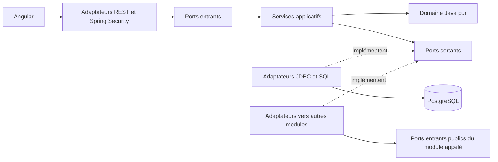

# Architecture de BricoComptoir

Statut : architecture implémentée, neuf modules métier et bootstrap. Date : 28 septembre 2026.

## 1. État constaté et périmètre

À l'étape initiale, le répertoire ne contenait que `.git`, sans commit ni
référence distante. À la préparation de publication du 28 septembre 2026,
la branche active est `main`, avec le commit de socle `1084e6e` et les modules
développés dans l'arbre de travail. L'origine est
`https://github.com/skpato1/brico-comptoir.git` ; la lecture des branches
distantes n'a encore retourné aucune référence. Le journal conserve les
vérifications initiales et les résultats ultérieurs.

Ce document décrit le code livré : identité, catalogue, médias, inventaire,
packs, ventes, contenus, notifications et confidentialité. Les contrats figurent
notamment dans [inventory.md](inventory.md), [packs.md](packs.md),
[cart.md](cart.md) et [checkout.md](checkout.md). Le détail des
[permissions et contrats identity](identity.md) complète cette section. La [roadmap](roadmap.md) organise leur réalisation et le
[suivi](progress.md) distingue les étapes terminées des étapes prévues.

BricoComptoir vend des articles de quincaillerie aux particuliers en Tunisie,
à l'unité ou sous forme de packs composés de produits individuels.

Décisions pour le premier périmètre :

- Une boutique, un dépôt de stock, une devise TND, interface française initiale.
- Quantités entières dans l'unité de vente du produit : une boîte de vis peut
  être un produit. Vente au poids ou à la découpe hors premier périmètre.
- Packs virtuels, sans stock propre, sans packs imbriqués ni substitutions.
- Consultation publique ; commande invitée ou via compte client. La propriété
  invitée repose sur la session serveur, détaillée dans [checkout.md](checkout.md).
- Panier visiteur conservé dans le navigateur avec uniquement références,
  quantités et identifiant de fusion ; panier client persisté par compte dans
  PostgreSQL. Reprise après connexion idempotente, décrite dans
  [cart.md](cart.md). Aucun stock réservé au panier, aucune promesse de prix et
  aucune adresse conservée dans le navigateur.
- Paiement à la livraison uniquement au lancement ; pas d'intégration bancaire
  ni de faux écran de paiement. Tarif de livraison forfaitaire configurable
  côté serveur et obligatoire avant ouverture commerciale.
- Les tarifs, règles fiscales, zones desservies et procédures de livraison
  devront être validés par l'exploitant avant ouverture ; aucun taux fiscal ou
  montant commercial n'est inventé ici.

## 2. Structure technique et frontières

Un monolithe Spring Boot déployable, un frontend Angular et une base PostgreSQL.
Un seul projet Maven backend, organisé par modules métier et contrôlé par des
tests d'architecture. Multiplier les artefacts Maven n'est pas nécessaire au
démarrage. Le socle fixe Java 21, Spring Boot 4.1.1, Angular 21.2.24,
Node 24.18.0, PostgreSQL 18.6 et Maven 3.9.16 via son wrapper.
Spring Security 7.1.1 et Flyway 12.4.0 suivent les versions gérées par le parent Spring Boot ;
les dépendances frontend sont résolues dans `package-lock.json`.

La page Angular utilise la même origine via Nginx en Compose ou le proxy Angular
en développement natif. Les routes de santé et les routes publiques d'identité
énumérées dans [identity.md](identity.md), ainsi que les lectures publiques du
[catalogue](catalog.md), sont ouvertes ; les autres restent
fermées par défaut. Aucun compte par défaut n'est créé. Le [contrat OpenAPI](openapi.yaml)
du socle décrit la santé ; les contrats identity sont dans `identity.md`. Le
[README](../README.md) décrit les commandes et profils `local`, `test`, `prod`.

MinIO sert de stockage objet local privé au module `media`, via le port
`ObjectStorage`. Les [photos de packs](pack-media.md) reprennent la validation
et les rendus des produits, avec visibilité contrôlée par `PackPhotoQueries`.
Mailpit sert de transport SMTP local au module `notifications`
pour les commandes, leurs statuts et la récupération du mot de passe.
MinIO est construit depuis la version officielle `RELEASE.2025-10-15T17-29-55Z`,
sa distribution communautaire étant désormais fournie en sources ; Mailpit
utilise `v1.31.2`. Voir la [publication MinIO](https://github.com/minio/minio/releases/tag/RELEASE.2025-10-15T17-29-55Z).

Arborescence existante :

```text
backend/
  pom.xml
  src/main/java/tn/bricocomptoir/
    bootstrap/                 # démarrage et assemblage Spring
    identity/
    catalog/
    media/
    inventory/
    packs/
    sales/
    content/
    notifications/
    privacy/
  src/main/resources/db/migration/
  src/test/
frontend/
  src/app/
    core/                      # transport HTTP et session
    features/                  # catalogue, panier, compte, commandes, administration
    shared/                    # composants de présentation
docs/
AGENTS.md
```

Chaque module backend suit cette structure :

```text
<module>/
  domain/                      # entités, valeurs, invariants, Java pur
  application/
    port/in/                   # cas d'usage publics et contrats Java immuables
    port/out/                  # besoins du module : dépôt, horloge, autre module
    service/                   # orchestration, règles d'accès applicatives
  adapter/
    in/web/                    # REST, validation du transport, DTO HTTP
    out/persistence/           # JDBC, SQL et mappings privés
    out/module/                # appels des ports publics d'autres modules
    security/                  # intégration Spring Security si nécessaire
    transaction/               # décorateurs transactionnels Spring
```



Les flèches pleines représentent les appels ; les adaptateurs implémentent les
interfaces définies au centre. Le câblage Spring est extérieur au domaine.

### Déploiement du navigateur sur Vercel

Angular reste une application statique ; `vercel.json` et
`scripts/build-vercel.mjs` génèrent les fichiers navigateur et le routage
Build Output API v3 depuis la racine du monorepo. `/api` est traité avant le
repli SPA, vers l'origine HTTPS `BRICO_API_ORIGIN`. Cookies et CSRF restent sous
la même origine publique. Sans origine, la réponse est 503, sans API fictive.
Les réponses API ne sont pas mises en cache par le CDN. Le backend Spring Boot
et ses dépendances restent des services durables hébergés séparément ; sessions
en mémoire et worker planifié ne sont pas migrés vers un runtime à mise en veille.
Cette configuration ne touche ni le domaine ni les ports des modules. Les
paramètres et contrôles effectifs sont dans [deployment.md](deployment.md).

### Dépendances autorisées

Le module `privacy` dépend uniquement des ports publics entrants d’`identity`,
`sales` et `notifications`, depuis ses adaptateurs sortants de modules. Ces
modules ne dépendent pas de `privacy`. Les politiques et l’orchestration restent
Java pur. Les transactions réunissent retrait, coordonnées, panier, jetons,
consentement et messages ; détails et exceptions de conservation dans
[privacy-decisions.md](privacy-decisions.md).

| Couche | Dépendances permises | Interdictions principales |
| --- | --- | --- |
| `domain` | JDK, domaine de son propre module | Spring, JPA, Jackson, HTTP, Angular, autres modules |
| `application` | Domaine local, ports et contrats locaux, JDK | Spring, JPA, adaptateurs, imports directs d'un autre module |
| `adapter` | Application/domaine locaux, bibliothèques techniques nécessaires | Règles métier cachées dans un contrôleur ou une entité JPA |
| `adapter/out/module` | Ports entrants et DTO Java publics du module appelé | Services internes, domaine, repositories ou tables du module appelé |
| `bootstrap` | Configurations et assemblage des modules | Logique métier |
| Angular | Contrats HTTP publiés | Accès à PostgreSQL, modèle JPA, décision d'autorisation faisant foi |

Les DTO HTTP, objets métier et lignes JDBC sont distincts. Aucune entité JPA
métier n'est définie dans cette version ; le starter JPA reste présent, avec
Hibernate en validation uniquement. Les ports n'exposent pas `Page`, `ResponseEntity`,
`Authentication` ou d'autres types Spring. Pas d'annotations Spring ou JPA dans
le domaine ni dans l'application. Les règles sont vérifiées avec ArchUnit.
Pas de module `common` générique : quelques valeurs locales simples peuvent
être dupliquées tant qu'aucun contrat partagé stable n'est nécessaire.

La boutique publique Angular est désormais routée : accueil, solutions/packs,
catalogue, fiches, panier, checkout, confirmation et compte. La session et le
panier sont partagés par les pages ; l'administration existante reste séparée
dans la navigation. Voir les choix d'affichage, les médias et l'accessibilité
dans [storefront.md](storefront.md).

## 3. Modules, ports et adaptateurs

| Module | Responsabilité et données possédées | Ports entrants principaux | Ports sortants principaux |
| --- | --- | --- | --- |
| `identity` | Comptes, profil minimal, identifiants de connexion, rôles, état actif, récupération | Inscrire un client, lire son profil, charger une identité pour l'authentification, administrer les accès, réinitialiser un mot de passe | `AccountStore`, `PasswordHasher`, `ResetStore`, `ResetDelivery` |
| `catalog` | Catégories, marques, produits/variantes, prix et publication | Consulter et administrer les SKU | `CatalogStore` |
| `packs` | Fiches et variantes de packs, prix propres, compositions et publication | Consulter/administrer les packs, lire une offre et sa composition | `PackStore`, `CatalogSkuLookup`, `StockAvailabilityLookup` |
| `media` | Métadonnées des photos de produit et de pack, ordre et image principale ; aucun binaire en base | Téléverser, ordonner, servir les rendus des offres visibles | `MediaStore`, `PackImageStore`, `ObjectStorage`, `ImageProcessor`, `CatalogProductLookup`, `PackPhotoLookup` |
| `inventory` | Quantités physiques et réservées par variante, réservations, mouvements | `InventoryOperations`, `InventoryAvailabilityQueries`, `InventoryOrderOperations` | `InventoryStore`, `VariantReferencePort` |
| `sales` | Panier client, commandes figées, coordonnées, livraison et idempotence | Estimer/fusionner/modifier le panier, prévisualiser, placer et traiter une commande ; `PersonalSales` | `CartStore`, `OrderStore`, `OfferLookup`, `CheckoutOffers`, `OrderStock`, `StockLookup`, `DeliveryFees`, `DeliverySettingsStore`, `OrderNotifications`, `CustomerContact`, `OrderEventFeed` |
| `content` | Textes structurés de l'accueil, sans HTML ni URL libre | Lire et modifier la fiche d'accueil versionnée | `HomeContentStore` |
| `notifications` | Outbox chiffrée, reprises email, journal durable des nouvelles commandes | `NotificationOperations`, `OrderEventQueries` | `EmailProvider`, `OutboxStore` |
| `privacy` | Préférence marketing, historique des choix, vérification de rectification email, conservation configurable et opérations sur les données | Consultation, export, rectification et retrait du périmètre courant ; archives et gels réservés à ADMIN | `PrivacyStore`, `PersonalData` adapté vers les ports publics des modules propriétaires |

Les ports ci-dessus existent dans les modules. Les opérations REST sont
portées par les adaptateurs entrants et des décorateurs transactionnels ;
les services purs ne constituent pas une API réseau.

Adaptateurs livrés :

- REST/JSON et filtres Spring Security pour les entrées externes.
- JDBC/PostgreSQL pour les agrégats persistés, avec SQL explicite pour verrous,
  versions et mises à jour atomiques. Les tables sont possédées par leur module.
- `PasswordEncoder` Spring Security derrière `PasswordHasher` ; chargement des
  comptes derrière l'adaptateur d'authentification, sans exposer les hashes REST.
- Adaptateurs internes synchrones : `sales` appelle `catalog` et `inventory` ;
  `inventory` appelle `catalog` pour valider les références produit lors d'une
  réception ou d'un ajustement administratif.
- Horloge système et configuration des frais côté serveur pour `sales`.

Graphe intermodules autorisé : `sales -> inventory -> catalog`,
`sales -> catalog`, `sales -> packs`, `packs -> catalog`, `packs -> inventory`
et `media -> catalog`, `media -> packs`, toujours via les ports entrants publics des modules
appelés. S'ajoutent `sales -> identity`, `sales -> notifications` et
`identity -> notifications`. `notifications` reste indépendant ; le flux SSE
est un adaptateur entrant de `sales`, qui vérifie ses gestionnaires via un port
identité et lit le journal via un port notifications. Aucun cycle ni lecture
directe de table d'un autre module. Voir [notifications.md](notifications.md).
Le câblage de sécurité fournit à chaque cas d'usage un acteur Java immuable
créé depuis l'identité authentifiée ; cet acteur ne provient jamais du JSON
client. La commande mémorise son `customerId`, sans importer le domaine identité.

Le catalogue ne dépend pas du stock. Angular combine la lecture des offres et
leur disponibilité indicative ; la commande vérifie de nouveau le stock réel.
Les mutations de réservation ne sont pas exposées directement en HTTP.
Le module `content` est indépendant. L'administration routée et sa matrice de
permissions sont détaillées dans [administration.md](administration.md).
`sales` possède désormais `DeliverySettingsStore` : réglages versionnés en base
après le premier enregistrement, configuration d'environnement auparavant.
V9 conserve les instantanés de commandes et ne contient aucun tarif commercial.
Les appels entre modules restent locaux, sans bus, requêtes HTTP internes,
microservices, CQRS séparé ou event sourcing.

## 4. Modèle conceptuel et invariants

| Concept | Identité et relations | Règles essentielles |
| --- | --- | --- |
| Compte | UUID, email normalisé unique, hash, rôles, état actif, version | Inscription = `CUSTOMER` uniquement ; désactivation conservant l'historique |
| Catégorie | UUID, parent facultatif, slug unique, libellé, actif, version | Hiérarchie sans cycle ; archivage interdit si enfant ou produit la référence |
| Marque | UUID, slug unique, libellé, actif, version | Facultative sur un produit ; archivage interdit si un produit la référence |
| Produit | UUID, catégorie, marque facultative, fiche et caractéristiques, statut `DRAFT`/`PUBLISHED`, version | Fiche de présentation ; publique seulement avec une variante publiée ; retour en brouillon plutôt que suppression |
| Variante | UUID, produit, SKU unique, libellé, options, unité, prix TND, statut et version | Référence vendable et référence de stock ; quantité entière ; prix décimal positif |
| Pack | UUID, code unique, nom, slogan, guide, statut, version | Fiche publiée seulement avec au moins une variante vendable ; prix porté par la variante |
| Variante de pack | UUID, pack, code local, libellé, prix propre TND, statut, version | Composition complète ; prix indépendant de la somme des composants |
| Composant de pack | `(packVariantId, catalogVariantId)`, quantité positive | Un SKU agrégé au plus une fois par variante ; pas de pack imbriqué |
| Stock variante | `variantId` unique, `onHand`, `reserved` | `0 <= reserved <= onHand` ; disponible = `onHand - reserved` |
| Réservation | UUID de réservation, lignes `(reservationId, variantId)` uniques, quantité, état | État `ACTIVE`, `RELEASED` ou `CONSUMED` ; quantité agrégée par variante ; la commande référence la réservation |
| Mouvement | UUID, produit, type, deltas physique/réservé, référence, acteur, date, motif | Journal append-only ; correction par mouvement compensateur |
| Commande | UUID servant de référence unique, client facultatif/session invitée, statut, coordonnées séparées, total, date | Propriété serveur, montants figés, transitions explicites, coordonnées rectifiables avant préparation puis archivables |
| Ligne de commande | Commande, type `PRODUCT`/`PACK`, référence, quantité | Libellé, version, prix et composition copiés au moment de l'achat |
| Composant commandé | Ligne pack, produit, SKU/libellé figés, quantité unitaire | Explique les produits réellement réservés, même si le pack évolue |
| Requête idempotente | `(ownerScope, key)` unique pour le placement, empreinte, commande | Propriétaire client/session invitée ; empêche une deuxième commande lors d'un renvoi du même achat |

Relations : catégorie `1 -> N` sous-catégories et produits ; produit `1 -> N`
variantes ; pack `1 -> N` composants `N -> 1` variante ; client `1 -> N`
commandes ; commande `1 -> N` lignes ; commande `1 -> N` réservations de
variantes. Les relations intermodules sont des identifiants,
pas des associations JPA navigables.

Les montants sont des valeurs décimales exactes en TND, avec trois décimales,
avec `BigDecimal` et les validations propres aux modules ; jamais `float` ou `double`.
Les saisies avec précision excessive sont rejetées. Les contrats JSON utilisent
des chaînes décimales et la devise. Les prix de vente affichés sont les prix
finaux à payer ; les règles fiscales détaillées restent à valider avant vente.
Total = somme des prix unitaires figés multipliés par les quantités + livraison.
Pas de promotions, conversion monétaire ou moteur fiscal dans le premier lot.

Un pack n'est vendable que si lui-même et tous ses composants sont actifs.
La disponibilité d'un pack seul est le minimum de
`floor(disponibleVariante / quantitéDansPack)` sur ses composants. Ce nombre
est indicatif : dans un panier mixte, toutes les demandes d'un même produit
s'additionnent, qu'elles proviennent d'un produit seul ou de plusieurs packs.
Une ligne de stock absente équivaut à zéro disponible.

Le module `packs` fournit dès maintenant une valeur d'offre unitaire contenant
prix, versions de fiche/variante et composition, lue sous un instantané
`REPEATABLE READ` lorsqu'elle ouvre sa propre transaction. Le module
`sales` assemble les offres d'un achat mixte dans une transaction
commune, vérifie à nouveau leur publication et leurs versions, puis agrège
toutes les demandes SKU avant la réservation atomique. Voir [checkout.md](checkout.md).
Toute modification de
fiche incrémente sa version ; prix, composition et état d'une variante
incrémentent la sienne. La commande conserve les valeurs acceptées, sans
réécrire son historique après une édition du catalogue ou des packs.

## 5. Authentification et RBAC

### Session et sécurité du navigateur

Même origine en production : Angular sur `/`, backend sur `/api/v1` derrière le
reverse proxy. En développement, proxy Angular vers le backend. Session serveur
Spring Security ; identifiant en cookie `HttpOnly`, `Secure` en production,
`SameSite=Lax`, sans attribut `Domain`. Rotation de session à la connexion,
expiration après 30 minutes d'inactivité, déconnexion par POST et invalidation
serveur. Une instance backend au départ, sessions en mémoire : un redémarrage
demande une reconnexion. Le besoin de plusieurs instances justifierait plus tard
un stockage de sessions partagé.

La passerelle écrase les en-têtes de transfert entrants. Le backend n'accepte
leur interprétation que depuis les adresses définies par `TRUSTED_PROXY_PATTERN`
en production ; son port reste privé. Cette frontière évite de partager le
limiteur de connexion entre tous les clients ou d'accepter une adresse forgée.
Une chaîne de plusieurs proxies exige une configuration de confiance explicite
à chaque couche, détaillée dans le README.

CSRF actif sur toutes les mutations, y compris connexion, inscription et logout.
`GET /auth/csrf` délivre le cookie `XSRF-TOKEN`, lisible par Angular ; celui-ci
renvoie `X-XSRF-TOKEN`. Le cookie de session reste inaccessible à JavaScript.
Obtenir un nouveau jeton après connexion/déconnexion et utiliser l'intégration
SPA adaptée à la version retenue de Spring Security, notamment pour les jetons
différés et BREACH. Voir les références officielles
[Spring Security CSRF](https://docs.spring.io/spring-security/reference/servlet/exploits/csrf.html)
et [Angular XSRF](https://angular.dev/best-practices/security#httpclient-xsrf-csrf-security).

Pas de JWT dans `localStorage`, de serveur OAuth maison ou de fournisseur
d'identité supplémentaire au départ. CORS fermé en production ; une éventuelle
exception de développement doit énumérer les origines exactes. TLS obligatoire,
CSP adaptée au build Angular, pas de secrets ou mots de passe dans les logs.

Les mots de passe sont hachés via `DelegatingPasswordEncoder` et un encodeur
adaptatif Argon2id ; ses paramètres devront être mesurés sur le serveur cible ; le format stocké
permet une évolution des paramètres. Aucune cryptographie maison. Référence :
[stockage des mots de passe Spring Security](https://docs.spring.io/spring-security/reference/features/authentication/password-storage.html).
Limiter les essais de connexion et d'inscription, retourner une erreur de
connexion générique, borner la taille des entrées et ne jamais sérialiser les
identifiants techniques sensibles.

Un filtre relit l'état actif et la version du compte à chaque requête
authentifiée ; une désactivation, une modification des rôles ou du mot de passe
invalide la session sans attendre son expiration. Le premier administrateur
local est créé par une commande explicite avec secret fourni à l'exécution,
limitée à `local & !prod`. Le provisionnement initial en production exige une
procédure contrôlée de l'exploitant, décrite comme décision restante dans
[deployment.md](deployment.md). Aucun compte par défaut ni endpoint public de promotion.

### Matrice d'accès

Les rôles `CUSTOMER`, `CATALOG_MANAGER`, `ORDER_MANAGER` et `ADMIN` sont
explicites et cumulables ; `ADMIN` n'implique pas `CUSTOMER`. La matrice détaillée,
est tenue dans [security.md](security.md), complétée par les contrats de
[identity.md](identity.md) et des modules métier.

Spring Security refuse par défaut toute route non explicitement autorisée et
filtre les routes publiées ; les services applicatifs vérifient également
les permissions, la propriété des ressources et les transitions métier avec
l'acteur fiable. Un UUID non devinable ne remplace pas ce contrôle. Une commande
d'un autre client retourne `404` sur le parcours client ; une session absente
retourne `401`, un rôle insuffisant ou un CSRF invalide `403`. Aucun guard Angular
ne remplace ces protections. Les opérations administratives sensibles sont
auditées avec acteur, cible et date, sans exposer de données personnelles inutiles.
Les modifications d'accès sont sérialisées dans une transaction du module
identité avant de vérifier qu'au moins un administrateur actif subsiste ; deux
retraits concurrents ne doivent pas pouvoir contourner cette règle.

## 6. Stock, commandes et transactions

### Frontière transactionnelle

Une seule source de données et un seul gestionnaire de transactions PostgreSQL.
Un décorateur Spring autour du cas d'usage entrant ouvre la transaction ; les
appels de commande à `inventory` exigent la même transaction (`MANDATORY`,
jamais `REQUIRES_NEW` pour le stock d'une commande). Une erreur métier doit
provoquer le rollback complet, y compris si elle est une exception vérifiée.
Aucun appel réseau externe pendant les verrous.

Le noyau inventory utilise `READ COMMITTED`. Prévisualisation et placement de
commande utilisent `REPEATABLE READ` pour un instantané cohérent des offres,
avec verrous explicites sur les lignes de stock et contraintes en base. Le
placement réessaie au plus trois fois les conflits de sérialisation/verrouillage,
puis retourne une indisponibilité. Prendre tous les verrous de SKU dans
l'ordre croissant de leur UUID réduit les interblocages ; une erreur transitoire
de verrouillage annule tout et autorise un nouvel essai borné de la transaction.
Le [contrat du noyau inventory](inventory.md) précise les invariants, l'ordre
des verrous et les opérations réellement exposées. Référence :
[verrous PostgreSQL](https://www.postgresql.org/docs/current/explicit-locking.html).

### Passer une commande

1. Identifier l'acteur client ou la session invitée ; valider les quantités, les limites de requête
   et l'adresse. Exiger une clé `Idempotency-Key`.
2. Dans la transaction, acquérir la clé unique portée par ce client et
   l'opération. Une collision attend la transaction précédente ; même empreinte
   = retourner la commande existante, empreinte différente = `409`.
3. Relire un instantané catalogue et les frais serveur. Comparer versions
   d'offres et total attendus à la prévisualisation confirmée par le client.
   Une divergence impose une nouvelle prévisualisation (`409 OFFER_CHANGED`).
4. Décomposer les packs, multiplier par les quantités commandées et agréger
   les besoins par produit. Borner les calculs pour éviter les dépassements.
5. Verrouiller chaque ligne de stock concernée avec `SELECT ... FOR UPDATE`
   dans l'ordre convenu. Contrôler `onHand - reserved >= besoin` pour tous les
   produits. Une ligne absente ou insuffisante fait échouer l'ensemble.
6. Incrémenter `reserved`, créer les réservations `ACTIVE` et les mouvements
   `RESERVE`. Créer la commande `CONFIRMED` et ses instantanés de lignes.
7. Associer la clé idempotente à la commande et committer une seule fois.
   Si une écriture échoue, ni commande, ni réservation, ni clé réussie ne subsiste.

La clé et l'empreinte normalisée de la requête sont conservées avec la commande.
Un renvoi après perte de réponse retrouve cette commande, même si le catalogue
a changé entre-temps. Une réservation reste active jusqu'au traitement ou à
l'annulation ; le premier périmètre à paiement à la livraison n'introduit pas
de réservation temporaire ni de tâche d'expiration. L'administration doit rendre
visibles les commandes en attente pour éviter les immobilisations oubliées.

### Cycle de vie et écritures de stock

```text
CONFIRMED -> PREPARING -> SHIPPED -> DELIVERED
    |            |
    +------------+------> CANCELLED
```

| Opération | Delta physique | Delta réservé | Conditions |
| --- | --- | --- | --- |
| Réception | `+q` | `0` | Admin, produit valide, quantité positive, motif/référence |
| Ajustement | `+/-q` | `0` | Admin, motif obligatoire, nouveau physique >= réservé |
| Réservation | `0` | `+q` | Commande nouvelle, disponibilité suffisante |
| Annulation | `0` | `-q` | Réservation active, avant expédition |
| Expédition | `-q` | `-q` | Réservation active, commande `PREPARING` |
| Livraison | `0` | `0` | Commande `SHIPPED` |

Annulation et expédition verrouillent d'abord la commande, puis les stocks dans
le même ordre, puis changent réservations, mouvements et statut dans une seule
transaction. Cela tranche une course entre ces deux opérations. Une transition
déjà appliquée est sans nouvel effet ; une transition incompatible retourne
`409`. Le client ne peut annuler que `CONFIRMED`, l'admin également `PREPARING`.
Les retours après expédition nécessitent un futur cas d'usage dédié : aucun
restockage automatique par changement arbitraire de statut.

Réceptions et ajustements portent un `operationId` unique pour rejouer une
requête sans doubler le mouvement ; la même clé avec d'autres paramètres est
rejetée. La première réception crée la ligne de stock à zéro via insertion
protégée par unicité, puis la verrouille et l'incrémente. Un historique n'est
jamais supprimé pour corriger un stock. La mise à jour du solde et le mouvement
correspondant sont toujours atomiques.

## 7. Persistance et migrations

Une base, un schéma applicatif PostgreSQL `bricocomptoir`, tables préfixées par module
(`identity_`, `catalog_`, `inventory_`, `sales_`). Chaque table appartient à un
seul module. Pas de lecture/écriture ni jointure intermodules dans les repositories.
Les identifiants externes sont validés via ports ; les références historiques
survivent à l'archivage. Les clés étrangères sont internes aux modules au départ.

Contraintes implémentées : SKU/email/codes uniques, unicité stock par variante et
lignes uniques par réservation/variante, clés d'idempotence uniques, quantités positives,
soldes non négatifs et `reserved <= onHand`. Le journal et les soldes sont
cohérents grâce aux écritures transactionnelles ; un contrôle de rapprochement
permettra de détecter une anomalie d'exploitation sans réécrire l'historique.
Versions optimistes pour les éditions administratives, avec conflit explicite.

Flyway est l'unique responsable du DDL, dans une séquence globale versionnée
`V<numero>__<module>_<description>.sql`. Une migration déjà appliquée est immuable.
Hibernate reste en mode `validate` sans entités métier ; il ne valide donc pas
les tables JDBC. Flyway contrôle les migrations et leurs checksums, les tests
PostgreSQL leurs contraintes. Pas de `update`/`create` en production.
Tester les migrations sur base vide et depuis la version précédente. Le compte
de migration a les droits DDL ; le compte applicatif dispose des droits DML
nécessaires. Les données de démonstration restent hors migrations de production.

Le socle crée le schéma par Flyway et applique V1 pour ses permissions et les
droits par défaut des futures tables. Il n'ajoute aucune table métier factice.
Les comptes de migration et d'application sont distincts, y compris en local.
Les secrets locaux sont générés dans `.env` ignoré par Git ; en production ils
doivent être injectés par l'environnement. La santé et la readiness restent
centrées sur PostgreSQL : une panne SMTP retarde les emails dans l'outbox sans
faire échouer une commande validée ni une demande de récupération enregistrée.
Sa disponibilité et les échecs terminaux devront être surveillés séparément
avant ouverture ; une panne MinIO affecte les photos sans bloquer la santé API.

Le module `media` valide type décodé, taille et dimensions, puis génère des
rendus compressés pour cartes et fiches. Les originaux sont privés dans MinIO,
les réponses paginées ne contiennent que des URL de rendus réduits. L'import
CSV du catalogue suit un aperçu sans mutation, puis une application atomique
du même fichier vérifié par SHA-256. Voir les [contrats détaillés](catalog.md).

Les instants sont stockés en UTC (`timestamptz`) et présentés en `Africa/Tunis`.
Adresses et téléphones sont des chaînes structurées, pas des nombres ; le pays
initial est `TN`, avec validation serveur du gouvernorat, code postal, adresse
et téléphone. Sauvegardes et restauration testée sont requises avant ouverture.

## 8. Contrats API livrés

### Conventions

- REST JSON UTF-8 sous `/api/v1`. Le contrat OpenAPI du socle décrit la santé ;
  les contrats fonctionnels sont détaillés dans les documents de chaque module.
- Identifiants UUID en chaînes, dates ISO 8601 avec décalage UTC, montants
  `{"amount":"49.900","currency":"TND"}`. Aucune entité JPA en réponse.
- Listes paginées : `page` à partir de 0, `size` de 1 à 100, défaut 20 ; tri
  sur liste blanche avec second critère stable par identifiant.
  Réponse `{items, page, size, totalElements}`.
  La liste publique des packs, les référentiels publics et certains sélecteurs
  administratifs restent des listes simples. Les tableaux administratifs
  utilisent les routes paginées ; aucun journal HTTP des mouvements de stock
  ni liste de comptes n'est livré.
- Corps strictement validés et bornés ; maximum initial de 100 lignes par achat
  et 1 à 999 unités par ligne, contrôlés avant et après fusion des doublons.
  Rejeter les champs sensibles inconnus, notamment
  `roles` à l'inscription, `customerId`, prix imposé ou statut dans une commande.
- Prix et stock sont calculés par le serveur. Les versions/total attendus
  envoyés par le navigateur expriment un accord, jamais une valeur de confiance.
- `201` + `Location` pour une création, `200` pour lecture ou transition retournant
  la ressource, `204` pour logout/CSRF. `400` validation, `401` non connecté,
  `403` accès/CSRF, `404` absent ou non visible, `409` conflit métier/version,
  `429` limitation d'essais. Les réponses privées portent `Cache-Control: no-store`.
- Erreurs JSON avec `code` métier et, selon le module, `message` ou
  `details`. Les refus Spring Security et erreurs techniques sont génériques.
  Aucun contrat uniforme `problem+json`/`traceId` n'est livré ; aucun SQL,
  secret ou stack trace ne doit apparaître en réponse.

### Endpoints et permissions

Les chemins ci-dessous sont relatifs à `/api/v1` et existent dans les
contrôleurs. Les documents de module détaillent les corps, filtres et réponses.

| Méthode et chemin | Entrée / résultat principal | Accès |
| --- | --- | --- |
| `GET /auth/csrf` | `204`, délivre/renouvelle le cookie CSRF | Public |
| `POST /auth/register` | `{email,password}` -> `201` compte ; aucune connexion implicite | Public + CSRF |
| `POST /auth/login` | `{email,password}` -> `200` profil + session | Public + CSRF |
| `POST /auth/logout` | Invalide la session -> `204` | Session + CSRF |
| `GET /auth/me`, `GET /accounts/{id}` | `{id,email,roles,active}` ; accès ciblé propriétaire ou ADMIN | Connecté |
| `POST /auth/password-reset/request`, `/complete` | Demande générique et récupération à jeton unique | Public + CSRF |
| `GET /categories`, `GET /brands` | Catégories et marques actives ; parent présent dans le résultat | Public |
| `GET /products`, `GET /products/{id}` | Recherche/pagination ; fiche et variantes publiées, prix TND et versions | Public |
| `GET /packs`, `GET /packs/{id}` | Offres publiées, variantes/composants et disponibilité indicative ; voir [packs.md](packs.md) | Public |
| `GET /availability/{variantId}` | Variante publiée : `{variantId,available}` | Public |
| `POST /cart/estimate` | Estimation indicative des lignes produit/pack, sans livraison ni réservation ; voir [cart.md](cart.md) | Public + CSRF |
| `GET /cart`, `PUT /cart`, `POST /cart/merge` | Panier client persisté, remplacement versionné et reprise idempotente | `CUSTOMER` ; CSRF pour écriture |
| `POST /checkout/preview` | Articles/version + adresse -> récapitulatif, frais, total et empreinte ; voir [checkout.md](checkout.md) | Invité ou `CUSTOMER`, CSRF |
| `POST /orders` | Articles/version + adresse + empreinte ; `Idempotency-Key` -> `201` commande | Invité ou `CUSTOMER`, CSRF |
| `GET /orders` | Historique du compte, pagination serveur | `CUSTOMER` |
| `GET /orders/{id}`, `POST /orders/{id}/cancel` | Lecture/annulation du propriétaire, y compris session invitée | Propriétaire ; CSRF pour annulation |
| `/admin/catalog/**` | Gestion des catégories, marques, fiches et variantes ; détails dans [catalog.md](catalog.md) | `CATALOG_MANAGER` ou `ADMIN` |
| `/admin/packs/**` | Gestion des fiches, variantes et compositions ; voir [packs.md](packs.md) | `CATALOG_MANAGER` ou `ADMIN` |
| `GET /admin/stock/{variantId}` | Soldes physiques, réservés et disponibles | `ADMIN` |
| `POST /admin/stock/adjustments` | `{operationId,variantId,delta,reason}` -> soldes ; réception via delta positif | `ADMIN` |
| `GET /admin/orders`, `GET /admin/orders/{id}` | Toutes les commandes, pagination et filtre de statut | `ORDER_MANAGER` ou `ADMIN` |
| `POST /admin/orders/{id}/prepare`, `/ship`, `/deliver`, `/cancel` | Transition explicite -> commande, pas de statut arbitraire | `ORDER_MANAGER` ou `ADMIN` |
| `POST /admin/internal-accounts`, `PUT /admin/accounts/{id}/roles`, `PATCH /admin/accounts/{id}/active` | Gestion ciblée des comptes, dernier ADMIN protégé | `ADMIN` |
| `/admin/catalog/products/{id}/images`, `GET /media/{id}/card`, `/detail` | Upload/ordre réservé ; dérivés publics si produit publié | Catalogue ou ADMIN pour écriture |
| `POST /admin/catalog/imports/preview`, `/apply` | CSV validé avant application atomique | Catalogue ou ADMIN |
| `GET /content/home`, `GET/PUT /admin/content/home` | Contenus principaux versionnés ; voir [administration.md](administration.md) | Lecture publique ; catalogue ou ADMIN pour gestion |
| `GET/PUT /admin/delivery` | Forfait et zones ; voir [checkout.md](checkout.md) | `ADMIN` |
| `GET /admin/order-events`, `/stream` | Événements durables et SSE ; voir [notifications.md](notifications.md) | Commandes ou ADMIN |
| `/admin/mail-outbox`, `POST /admin/mail-outbox/{id}/retry` | État paginé et reprise contrôlée | `ADMIN` |
| `/privacy/**`, `/admin/privacy/**` | Export, consentement, rectification, retrait, conservation et archives ; voir [privacy-decisions.md](privacy-decisions.md) | Propriétaire ; ADMIN pour opérations réservées |

Toutes les mutations de ce tableau exigent CSRF. Les prévisualisations sont
privées même si elles ne réservent rien. Les disponibilités publiques excluent
les offres non publiées, sans divulguer les quantités réservées ni le journal.

### Exemple de passage de commande

Exemple de format uniquement : les identifiants ne désignent pas des produits
existants. `/checkout/preview` reçoit le même corps sans `quoteHash` et renvoie
le récapitulatif calculé. Les lignes du panier sont déjà agrégées ; le checkout
refuse les doublons ambigus. Les deux versions de fiche/variante sont requises.

```http
POST /api/v1/orders
Content-Type: application/json
Idempotency-Key: 50166cab-19db-4e13-a051-02876255bd6f
X-XSRF-TOKEN: <jeton obtenu du serveur>
```

```json
{
  "items": [
    {"kind": "PRODUCT", "offerId": "67b6678e-6638-4e6e-9233-a0a8c370a9f2", "quantity": 2, "offerVersion": 3, "parentVersion": 5},
    {"kind": "PACK", "offerId": "da5398cc-01d8-453e-910c-6b01eb2f6a30", "quantity": 1, "offerVersion": 2, "parentVersion": 1}
  ],
  "address": {
    "recipient": "Exemple de destinataire",
    "street": "10 rue Exemple",
    "city": "Tunis",
    "governorate": "TUNIS",
    "postalCode": "1000",
    "country": "TN",
    "phone": "+21620000000"
  },
  "quoteHash": "<empreinte SHA-256 renvoyée par la prévisualisation>"
}
```

Le serveur retourne `{id, status, paymentMethod, createdAt, summary}` ; `summary`
contient l'adresse, les lignes/composants figés, `subtotal`, `delivery`, `total`
et `quoteHash`. Le succès et le rejeu identique valent `201` avec `Location`,
le même identifiant et sans effet supplémentaire. L'UUID est la référence de
commande initiale ; aucun générateur de numéros métier séparé n'est nécessaire.
La même clé avec un autre corps normalisé donne `409 IDEMPOTENCY_CONFLICT`.
La création de commande ne prétend pas que le paiement a été encaissé.

Exemple d'erreur attendue :

```json
{
  "type": "urn:bricocomptoir:problem:insufficient-stock",
  "title": "Stock insuffisant",
  "status": 409,
  "detail": "La commande ne peut pas être réservée intégralement.",
  "instance": "/api/v1/orders",
  "code": "INSUFFICIENT_STOCK",
  "traceId": "identifiant-de-correlation"
}
```

Autres codes stables : `VALIDATION_ERROR`, `AUTHENTICATION_REQUIRED`,
`ACCESS_DENIED`, `CSRF_INVALID`, `OFFER_CHANGED`, `VERSION_CONFLICT`,
`INVALID_ORDER_TRANSITION`. Angular affiche une erreur réelle et propose une
nouvelle prévisualisation en cas de changement ; il ne simule jamais un succès.

## 9. Vérification et arbitrages

Les tests du socle couvrent santé, sécurité par défaut, migrations réelles et
frontières d'architecture ; les contrôles métier suivants accompagneront leur code :

- Unitaires Java sans Spring : composition des packs, argent, agrégation des
  besoins, transitions, propriété, impossibilité de stock négatif et dernier admin.
- Architecture : aucune dépendance technique dans domaine/application, graphe
  des modules autorisé, absence d'accès aux détails privés d'un autre module.
- Intégration PostgreSQL via Testcontainers et migrations Flyway réelles :
  contraintes, rollback commande/stock/idempotence, concurrence produit seul
  contre pack et entre packs partageant un composant, annulation contre expédition,
  double réception, double soumission d'achat et réutilisation incorrecte de clé.
- Intégration Spring Security : session, CSRF avant/après login et logout,
  `401/403/404`, accès à la commande d'autrui, auto-attribution de rôle rejetée,
  retrait d'accès effectif sur une session existante.
- Angular : formulaires et erreurs utiles ; parcours E2E sur backend réel pour
  panier mixte, rupture, commande, consultation et opérations administratives.

H2 ne remplace pas PostgreSQL pour vérifier les migrations et verrous. Les
tests d'intégration ciblent une base isolée, jamais les données de production.

| Décision | Bénéfice / coût accepté | Quand la reconsidérer |
| --- | --- | --- |
| Neuf modules métier dans un backend | Transactions locales et exploitation simple ; discipline des frontières nécessaire | Équipe ou charge imposant une séparation démontrée |
| Packs virtuels, prix propre | Une seule vérité de stock ; disponibilité dérivée et composition figée à l'achat | Préassemblage physique ou substitutions demandés |
| Session serveur, même origine | Authentification navigateur simple ; reconnexion après redémarrage initial | Plusieurs instances ou clients externes |
| Panier visiteur navigateur, panier client PostgreSQL | Reprise après connexion et synchronisation du client, sans adresse ni prix dans le stockage visiteur | Besoin de panier visiteur multi-appareils |
| Réservation à confirmation, paiement à la livraison | Pas de workflow bancaire ; commandes en attente à traiter | Paiement en ligne réel ou expiration nécessaire |
| Verrous de lignes et transaction unique | Pas de survente ni compensation distribuée ; contention possible | Mesures montrant une limite de débit |
| Instantané catalogue à la lecture | Commande cohérente sans long verrou catalogue ; une édition ultérieure vaut pour l'achat suivant | Exigence métier plus stricte sur la fermeture immédiate d'une offre |
| Pas de broker, cache distribué, moteur de recherche ni abstraction fournisseur spéculative | Moins d'exploitation et de code sans usage | Besoin concret et mesuré |

Les emails transactionnels et le flux gestionnaire SSE sont livrés avec
V10 et les contrats de [notifications.md](notifications.md). Paiement en
ligne, transporteurs, retours, promotions et multi-dépôts restent des extensions.
La livraison d'emails en production nécessite un SMTP fiable,
un domaine public validé et des paramètres Argon2id mesurés avant ouverture.
